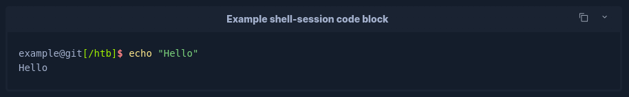
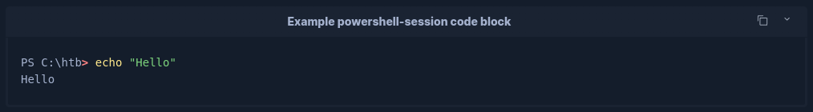

# Shell-Session Syntax Highlighting Plugin for Obsidian

This plugin enables syntax highlighting for the `(power)shell-session` language used by [HackTheBox](https://www.hackthebox.com/) on their learning platform, **HTB Academy**. The `shell-session` syntax makes it easier to distinguish between shell commands and their output, enhancing clarity and usability for technical notes involving terminal sessions.

With this plugin, you can bring the same `shell-session`/`powershell-session` formatting experience into [Obsidian](https://obsidian.md/), providing a seamless way to write and review shell command examples.

## Features

- **Syntax Highlighting:** Highlights shell / powershell commands and output within markdown code blocks.
- **Live Preview:** Works both in the Editor Mode and Reading Mode, providing real-time syntax highlighting as you edit or view notes.

## Installation

1. Download and Install the plugin from the [Release](https://github.com/Z3rf0x/obsidian-shell-session-syntax-highlighter/releases) page.
2. Extract the plugin into your `.obsidian/plugins/` directory. 
3. Enable the plugin by navigating to **Community Plugins** page.

## Usage

To use the shell-session syntax, wrap your shell commands in code blocks like so:
<pre>```shell-session 
user@machine[/htb]$ echo "Hello, World!" 
Hello, World!
```</pre>



And for the powershell-session syntax:
<pre>```powershell-session 
PS C:\htb> echo "Hello, World!" 
Hello, World!
```</pre>



## Configuration

Currently, no specific configuration options are available. The plugin will automatically enable syntax highlighting for any code block tagged with shell-session.

## Acknowledgments

This plugin was inspired by the work of [typhoon-kim](https://github.com/typhoon-kim/obsidian-svelte-syntax-highlighter), whose code greatly influenced its implementation. Thank you !

## Contributing

Contributions to the plugin are welcome! If you have any ideas for improvements, bug fixes, or new features, feel free to open an issue or submit a pull request.