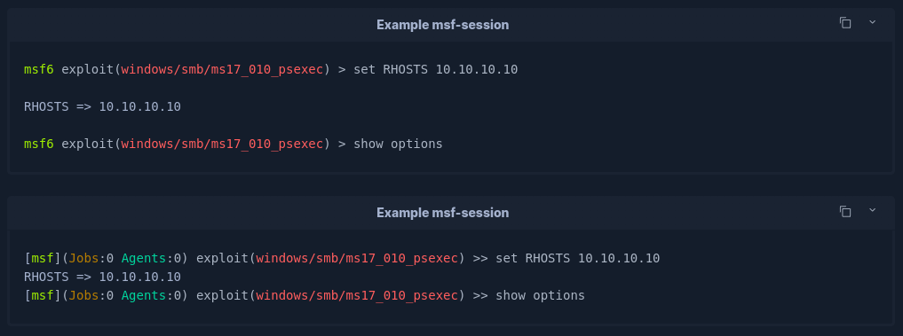

# Shell-Session Syntax Highlighting Plugin for Obsidian

This plugin enables syntax highlighting for various session-based languages used in **cybersecurity** platforms. It provides enhanced readability by distinguishing between commands and their outputs, making it easier to document and review terminal sessions.

With this plugin, you can seamlessly bring syntax highlighting for session-based command examples into [Obsidian](https://obsidian.md/), supporting formats like shell-session, powershell-session, msf-session, and more, to improve the clarity of technical notes.

## Features

-   **Syntax Highlighting:** Highlights shell / powershell commands and output within markdown code blocks.
-   **Live Preview:** Works both in the Editor Mode and Reading Mode, providing real-time syntax highlighting as you edit or view notes.

## Installation

1. Download and Install the plugin from the [Release](https://github.com/Z3rf0x/obsidian-shell-session-syntax-highlighter/releases) page.
2. Extract the plugin into your `.obsidian/plugins/` directory.
3. Enable the plugin by navigating to **Community Plugins** page.

## Usage

To use the shell-session syntax, wrap your shell commands in code blocks like so:

<pre>```shell-session 
user@machine[/htb]$ echo "Hello, World!" 
Hello, World!
```</pre>


For the powershell-session syntax:

<pre>```powershell-session 
PS C:\htb> echo "Hello, World!" 
Hello, World!
```</pre>


For the msf-session syntax:

<pre>```msf-session 
msf6 exploit(windows/smb/ms17_010_psexec) > show options
```</pre>



## Configuration

Currently, no specific configuration options are available. The plugin will automatically enable syntax highlighting for any code block tagged with shell-session.

## Acknowledgments

This plugin was inspired by the work of [typhoon-kim](https://github.com/typhoon-kim/obsidian-svelte-syntax-highlighter), whose code greatly influenced its implementation. Thank you !

## Contributing

Contributions to the plugin are welcome! If you have any ideas for improvements, bug fixes, or new features, feel free to open an issue or submit a pull request.
